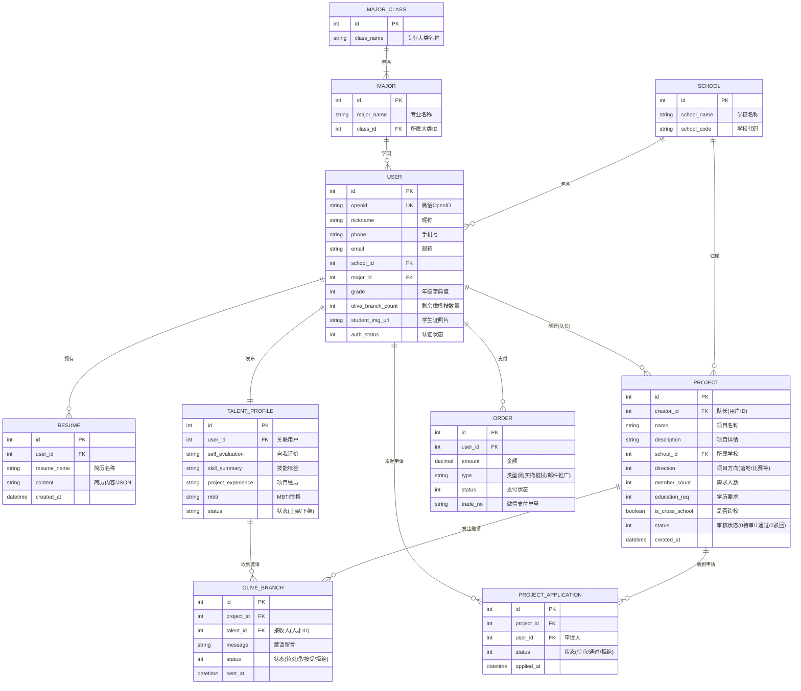

```mermaid
erDiagram
    %% ================= 基础字典 =================
    SCHOOL {
        int id PK
        string school_name "学校名称"
        string school_code "学校代码"
    }

    MAJOR_CLASS {
        int id PK
        string class_name "专业大类名称"
    }

    MAJOR {
        int id PK
        string major_name "专业名称"
        int class_id FK "所属大类ID"
    }

    %% ================= 用户中心 =================
    USER {
        int id PK
        string openid UK "微信OpenID"
        string nickname "昵称"
        string phone "手机号"
        string email "邮箱"
        int school_id FK
        int major_id FK
        int grade "年级字典值"
        int olive_branch_count "剩余橄榄枝数量"
        string student_img_url "学生证照片"
        int auth_status "认证状态"
    }

    RESUME {
        int id PK
        int user_id FK
        string resume_name "简历名称"
        string content "简历内容/JSON"
        datetime created_at
    }

    %% ================= 核心业务：人才库 =================
    %% 说明：用户需要单独创建人才档案才能进入人才库被搜索
    TALENT_PROFILE {
        int id PK
        int user_id FK "关联用户"
        string self_evaluation "自我评价"
        string skill_summary "技能标签"
        string project_experience "项目经历"
        string mbti "MBTI性格"
        string status "状态(上架/下架)"
    }

    %% ================= 核心业务：项目组队 =================
    PROJECT {
        int id PK
        int creator_id FK "队长(用户ID)"
        string name "项目名称"
        string description "项目详情"
        int school_id FK "所属学校"
        int direction "项目方向(落地/比赛等)"
        int member_count "需求人数"
        int education_req "学历要求"
        boolean is_cross_school "是否跨校"
        int status "审核状态(0待审/1通过/2驳回)"
        datetime created_at
    }

    %% 流程一：用户申请加入项目
    PROJECT_APPLICATION {
        int id PK
        int project_id FK
        int user_id FK "申请人"
        int status "状态(待审/通过/拒绝)"
        datetime applied_at
    }

    %% 流程二：队长向人才抛出橄榄枝
    OLIVE_BRANCH {
        int id PK
        int project_id FK
        int talent_id FK "接收人(人才ID)"
        string message "邀请留言"
        int status "状态(待处理/接受/拒绝)"
        datetime sent_at
    }

    %% ================= 增值服务 =================
    ORDER {
        int id PK
        int user_id FK
        decimal amount "金额"
        string type "类型(购买橄榄枝/邮件推广)"
        int status "支付状态"
        string trade_no "微信支付单号"
    }

    %% ================= 关系定义 =================
    
    SCHOOL ||--o{ USER : "包含"
    SCHOOL ||--o{ PROJECT : "归属"
    
    MAJOR_CLASS ||--|{ MAJOR : "包含"
    MAJOR ||--o{ USER : "学习"

    USER ||--o{ RESUME : "拥有"
    USER ||--|| TALENT_PROFILE : "发布"
    USER ||--o{ PROJECT : "创建(队长)"
    USER ||--o{ ORDER : "支付"

    PROJECT ||--o{ PROJECT_APPLICATION : "收到申请"
    USER ||--o{ PROJECT_APPLICATION : "发起申请"

    PROJECT ||--o{ OLIVE_BRANCH : "发出邀请"
    TALENT_PROFILE ||--o{ OLIVE_BRANCH : "收到邀请"
```